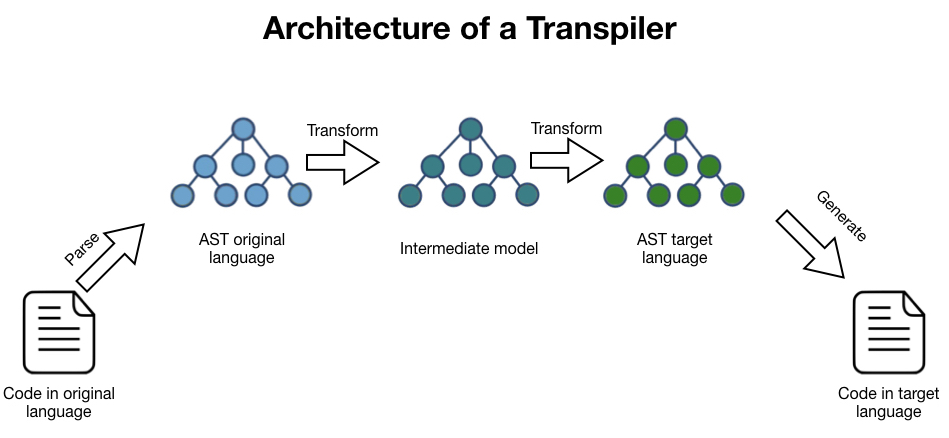
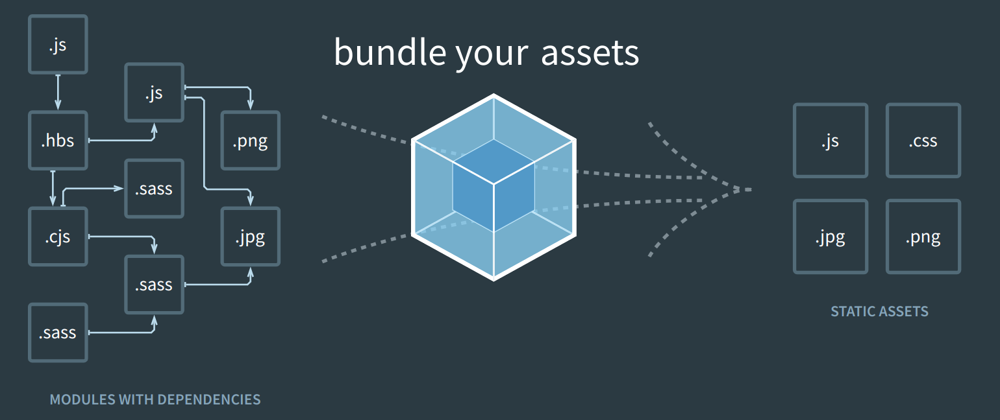

# ⚡State of front-end tooling and infra

## 🤔 Why should I care about tooling and infra?

- The Web is moving fast
- JavaScript is becoming faster? But how?
- Et al. apps are becoming faster
- We should know how to pick tooling
- Developer experience

## 🤯 Few Thiiiings

- JavaScript Runtimes 🏎️
- Transpilers 📑
- Bundlers 🧵
- Build systems 🔨
- Architectures: Micro front-ends, Islands 🏝️
- Vite, React RSC, Next, Remix, Astro, SvelteKit, Qwik 🗿
- Edge computing 🤖

## 🦀 Rust

- Systems programming language - control of low-level primitives
- Statically typed
- Memory safe
- Compiled
- No garbage collection
- Different memory management model - ownership and borrow

## **🏄** Go

- Statically typed
- Memory safe
- Garbage collected
- Concurrent
- Compiled
- Efficient
- Simple syntax
- Built-in support for testing and benchmarking

## 🏎️ JavaScript Runtimes

- Node.js - [https://nodejs.org/en](https://nodejs.org/en)
- Deno - [https://deno.com/runtime](https://deno.com/runtime)
  - Fresh - [https://fresh.deno.dev/](https://fresh.deno.dev/)
- Bun - [https://bun.sh/](https://bun.sh/)
  - Elysia - [https://elysiajs.com/](https://elysiajs.com/)

## 📑 Transpilers

ref: [https://tomassetti.me/how-to-write-a-transpiler/](https://tomassetti.me/how-to-write-a-transpiler/)

- Babel - [https://babeljs.io/](https://babeljs.io/)
- ESBuild
  - [https://esbuild.github.io/](https://esbuild.github.io/)
  - [https://github.com/evanw/esbuild/blob/main/internal/ast/ast.go](https://github.com/evanw/esbuild/blob/main/internal/ast/ast.go)
- SWC - [https://swc.rs/](https://swc.rs/)

## 🧵 Bundlers

ref: [https://webpack.js.org/](https://webpack.js.org/)

- Rollup - [https://rollupjs.org/](https://rollupjs.org/)
- Webpack - [https://webpack.js.org/](https://webpack.js.org/)
- Parcel - [https://parceljs.org/](https://parceljs.org/)
- ESBuild - [https://esbuild.github.io/](https://esbuild.github.io/)
- TurboPack - [https://turbo.build/pack](https://turbo.build/pack)
- SWCPack - [https://swc.rs/docs/usage/bundling](https://swc.rs/docs/usage/bundling)
- Rome (more than a bundler) - [https://rome.tools/](https://rome.tools/)

## 🔨 Build Systems

- ESBuild - [https://esbuild.github.io/](https://esbuild.github.io/)
- TurboRepo - [https://turbo.build/repo](https://turbo.build/repo)

## 🏝️ Architectures

- Micro front-ends - [https://martinfowler.com/articles/micro-frontends.html](https://martinfowler.com/articles/micro-frontends.html)
- Islands - [https://www.patterns.dev/posts/islands-architecture](https://www.patterns.dev/posts/islands-architecture)

## 🗿 Vite, React RSC, Next, Remix, Astro, SvelteKit, Qwik

- Vite - [https://vitejs.dev/](https://vitejs.dev/)
- React RSC
  - [https://www.patterns.dev/posts/react-server-components](https://www.patterns.dev/posts/react-server-components)
  - [https://beta.nextjs.org/docs/rendering/server-and-client-components](https://beta.nextjs.org/docs/rendering/server-and-client-components)
- Next - [https://nextjs.org/](https://nextjs.org/)
- Remix - [https://remix.run/](https://remix.run/)
- Astro - [https://astro.build/](https://astro.build/)
- Qwik - [https://qwik.builder.io/](https://qwik.builder.io/)
- SvelteKit - [https://kit.svelte.dev/](https://kit.svelte.dev/)

## 🤖 Edge Computing

- Computing - [https://blog.cloudflare.com/cloud-computing-without-containers/](https://blog.cloudflare.com/cloud-computing-without-containers/)
  - Vercel - [https://vercel.com/](https://vercel.com/)
  - Netlify - [https://www.netlify.com/](https://www.netlify.com/)
  - Deno Deploy - [https://deno.com/deploy](https://deno.com/deploy)
  - Cloudflare workers - [https://workers.cloudflare.com/](https://workers.cloudflare.com/)
  - Fly - [https://fly.io/](https://fly.io/)
- Database - [https://edge-data-latency.vercel.app/](https://edge-data-latency.vercel.app/)
  - Turso - [https://turso.tech/](https://turso.tech/)
  - PlanetScale - [https://planetscale.com/](https://planetscale.com/)
  - Fauna - [https://fauna.com/](https://fauna.com/)
  - Neon - [https://neon.tech/](https://neon.tech/)
